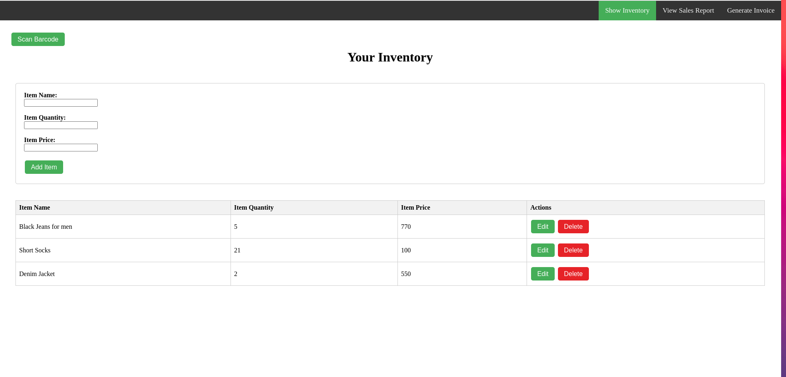
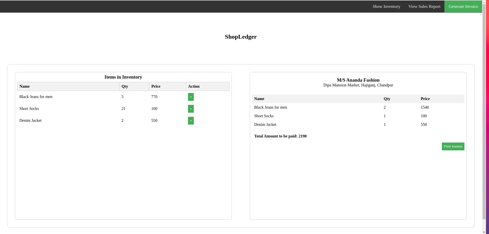
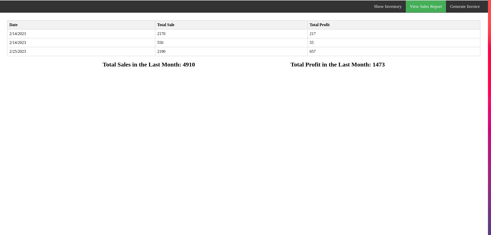

# ShopLedger

A web application for shopowner's to automate their tasks like

- managing inventory
- generating invoices
- create and manage daily sales report

### Show Inventory

### Generate Invoice

### View Sales Report

## Implemented features:

(Sourav)

- inventory management
  - add product via barcode
  - add product manually
  - CRUD operation functionality
- design and implement `generate invoice` page
- update inventory with respect to sold products
- design and implement 'sales report' page

(Soumik)

- add print functionality to `generate invoice` page
- add functionality to view total profit in the `sales report` page

(Abir)

- fix styles
- Report writing

## Things not working

- Barcode scanning functionality
